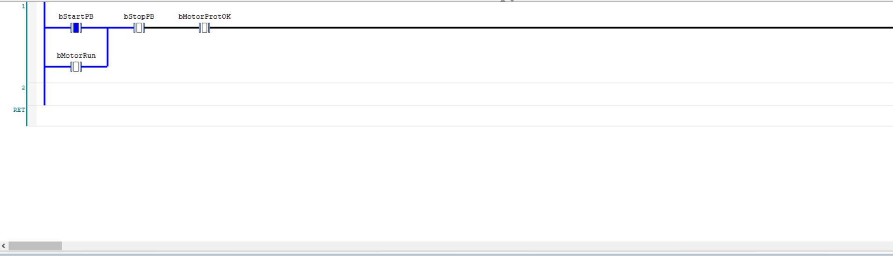
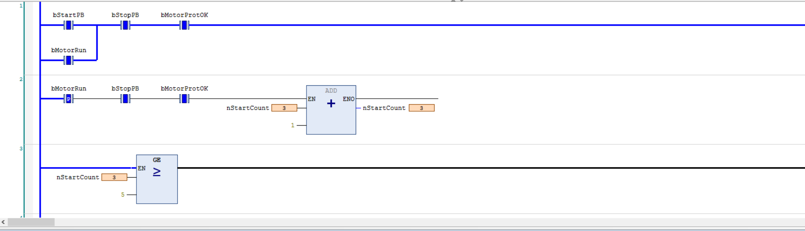
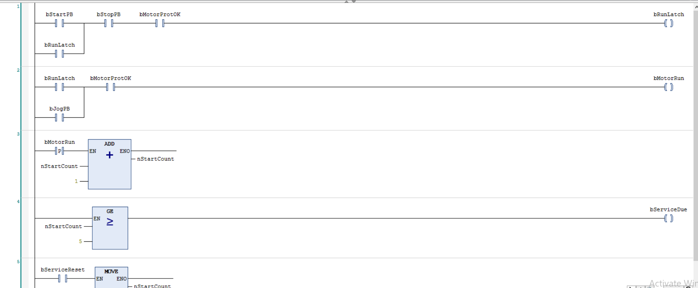
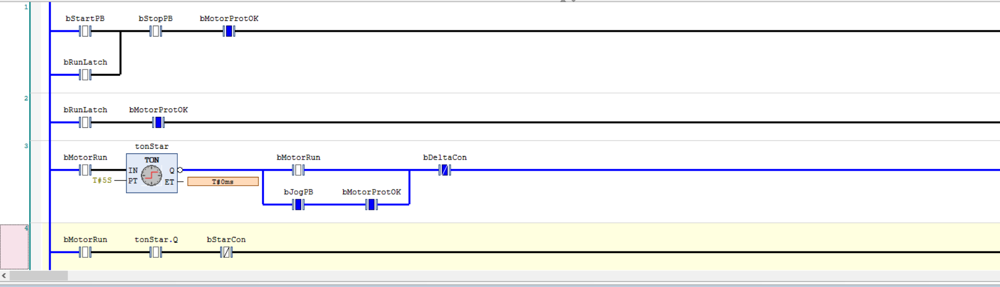

<!-- Optional: replace this line with a one-line intro about yourself (e.g. name, EE/CS student, focus areas). -->

# PLC Fundamentals in CODESYS — Motor Control & Legacy Conveyor Debugging

**Platform:** CODESYS V3.5 · CODESYS Control Win V3 (soft PLC, simulation mode) · IEC 61131-3 (Ladder Diagram + Structured Text)

This repository demonstrates command of the fundamentals of industrial PLC programming — in both Ladder and Structured Text — through a progression of tasks. Each task is stated as a **brief** (the kind of change request a controls engineer receives), then implemented and validated in the CODESYS simulator against explicit acceptance criteria. Several tasks are chosen specifically to surface the failure modes that cost real time in the field: the *double-coil*, *one-shot / edge detection*, *scan-order oscillation*, *fail-safe wiring*, and *requirements-vs-code* mismatches — and to show these being reasoned about at the scan-cycle level, not just made to run.

The debugging half (Part B) takes a deliberately broken legacy program and works from field symptoms back to the responsible lines and their mechanisms.

---

## Concepts demonstrated

- **Ladder (LD):** contacts, coils, seal-in latches, parallel (OR) branches, mutual interlocks
- **Structured Text (ST):** latches, `IF` / `ELSIF`, function-block instances, edge triggers, `TON` timers
- **Fail-safe design:** normally-closed field wiring, and why an NC device correctly appears as an NO contact (a cut wire must read as "stop")
- **Edge detection / one-shots** (`R_TRIG`) — and choosing *what* an event should mean (a button press vs. a contactor operation)
- **The scan cycle:** double-write bugs, statement/rung order, and why every output is written in exactly one place
- **State vs. output:** separating a latch (memory) from the command that drives an actuator
- **Staged starting:** star-delta sequencing with a `TON` and a hard mutual interlock
- **Debugging methodology:** reproduce → isolate to a rung/line → diagnose the *mechanism* → fix — and writing acceptance tests that pin the behaviour down (including tests that wait out a timer)

---

## Part A — Motor control, built incrementally

Each brief adds exactly one requirement to the previous program.

### 1 · Start/Stop with seal-in and fail-safe stop

> **Brief.** Inputs: `bStartPB` (momentary), `bStopPB` (momentary, wired **normally-closed** — TRUE when *not* pressed), `bMotorProtOK` (TRUE = healthy). Output: `bMotorRun`. Start starts the motor; it must stay running after Start is released — a seal-in, **no SET/RESET coils**. Stop, or loss of `bMotorProtOK`, stops it immediately. **Acceptance:** a broken Stop wire (`bStopPB` forced FALSE) must stop the motor, not leave it running.



A momentary Start latches the motor through a **seal-in** contact — the output feeds back to keep its own rung true after the button is released. The instructive point is the Stop button: it is a **normally-closed** field device, TRUE in normal operation and FALSE only when pressed *or when its wire is cut*, so it appears in the logic as a **normally-open** contact. A broken wire then fails to the safe "stopped" state — the fail-safe convention, and the reason competent programs show stop buttons as plain contacts.

### 2 · Maintenance start counter — the one-shot

> **Brief.** Add `nStartCount : INT` and `bServiceDue : BOOL`. Increment the count each time the motor *starts* (a stopped→running transition); light `bServiceDue` once the count reaches the threshold (the lamp does **not** stop the motor); a reset input returns the count to 0. **Constraint:** no counter function block — build it from `ADD`, `GE`, `MOVE`.



The naive version — *increment while Start is pressed* — counts once **per scan**, roughly +20 per press at a 10 ms scan, because ladder samples state every scan rather than reacting to events. Fixed with **rising-edge detection** on the run command, so one press = one count. Which signal's edge is used is a real design decision: the counter models contactor wear, so it counts the contactor coil, not the button.

### 3 · Jog, and separating latch from output — the double-coil

> **Brief (verbatim change request).** *"Maintenance wants a jog button. While `bJogPB` is held, the motor runs; released, it stops immediately — no latching. Normal start/stop must keep working exactly as before. Jog must still respect `bMotorProtOK`."*



The tempting implementation puts a *second coil* on the motor output — but two rungs writing one output is a **double-coil**, and only the last write of the scan survives. The failure is insidious: the seal-in silently stops working while jog *appears* to work, so the bug shows up in a different feature than the one that causes it. Fixed by computing a latch (`bRunLatch`) in one rung and driving the **single** motor coil from `(bRunLatch OR bJogPB) AND interlocks` in another. State lives in exactly one place; the output is written exactly once; jog deliberately never engages a later stage.

### 4 · Star-delta staged start — timers + interlock

> **Brief.** Replace the single motor output with two contactor outputs, `bStarCon` and `bDeltaCon`. Run command → **star** immediately → after **5 s**, star drops and delta pulls in → delta holds while the run command holds; run command drops → both off, and any restart begins again from star. **Hard safety requirement:** `bStarCon` and `bDeltaCon` must **never** be TRUE in the same scan (simultaneous closure is a phase-to-phase short) — enforce it with mutual interlock contacts, not by trusting the sequence. Jog uses **star only**. The counter now counts **star** pull-ins.



A single `TON` sequences the two contactors. The no-overlap requirement is enforced with **mutual normally-closed interlock contacts** (NC `bDeltaCon` in the star rung, NC `bStarCon` in the delta rung), and confirmed scan-by-scan in the live view — there is no scan in which both are energised. One timer instance, called once; its `.Q` output reused as a contact wherever the "elapsed" signal is needed.

---

## Part B — Debugging an inherited conveyor (Structured Text)

> **The situation.** You've inherited a conveyor program, last touched in 2011 by a contractor who no longer exists. The night shift's complaint, verbatim:
>
> *"The piece counter showed 400 after about a dozen boxes. The FULL lamp flickers sometimes instead of staying on. The belt sometimes restarts all by itself a few seconds after we stop loading. And yesterday the count vanished to zero on its own."*
>
> **Plant context:** `E_LS1` / `E_LS2` are light barriers (TRUE = beam blocked by a box) at the infeed and outfeed. Intended behaviour, as far as anyone remembers: start/stop-latched belt, a 3 s run-on after the infeed goes clear, piece counting at the outfeed, FULL lamp at 10 pieces, and some form of counter acknowledge.

### The program as inherited (verbatim)

```iecst
PROGRAM FOERDER_PRG
VAR
    E_START       : BOOL;         (* Taster Start *)
    E_STOP        : BOOL := TRUE; (* Oeffner! *)
    E_LS1         : BOOL;         (* Lichtschranke Einlauf *)
    E_LS2         : BOOL;         (* Lichtschranke Auslauf *)
    A_BAND        : BOOL;         (* Bandmotor *)
    A_LAMPE_VOLL  : BOOL;
    MERKER_1      : BOOL;
    HILF_MERKER_2 : BOOL;
    Z_STUECK      : INT;
    T_NACHLAUF    : TON;
    M13_4         : BOOL;
END_VAR

(* Bandsteuerung -- geaendert 03.11.2011 K.H. *)
MERKER_1 := (E_START OR MERKER_1) AND E_STOP;

A_BAND := MERKER_1;

(* Stueckzaehler am Auslauf *)
IF E_LS2 THEN
    Z_STUECK := Z_STUECK + 1;
END_IF

(* Voll-Meldung ab 10 Stueck *)
IF Z_STUECK >= 10 THEN
    A_LAMPE_VOLL := TRUE;
ELSE
    A_LAMPE_VOLL := FALSE;
END_IF

(* Nachlauf 3s wenn Einlauf frei -- NICHT ANFASSEN!! *)
T_NACHLAUF(IN := NOT E_LS1, PT := T#3S);
M13_4 := T_NACHLAUF.Q;

IF M13_4 THEN
    A_BAND := FALSE;
END_IF

(* Quittierung *)
HILF_MERKER_2 := E_START AND E_STOP;
IF HILF_MERKER_2 THEN
    Z_STUECK := 0;
END_IF
```

### How it was processed

Each complaint was reproduced in the simulator, isolated to the responsible line(s), and diagnosed for its **mechanism** before anything was changed:

**1 · Counter runs to 400 from ~12 boxes.**
`IF E_LS2 THEN Z_STUECK := Z_STUECK + 1; END_IF` runs *every scan* the outfeed beam is blocked. A box dwelling on the sensor for a fraction of a second adds dozens of counts at a 10 ms scan. There is no notion of "one box, one count" because ladder/ST react to *state*, not *events*. → count only on the **rising edge** of `E_LS2` (`R_TRIG`).

**2 · Belt restarts by itself a few seconds after loading stops — the centrepiece.**
This is not a restart; it is a **one-scan oscillation** caused by a **double write**. `A_BAND := MERKER_1;` at the top of the scan writes the output from the latch *every scan*. The run-on block clears only the *output* — `IF M13_4 THEN A_BAND := FALSE; END_IF` — but `MERKER_1` is still TRUE (nobody pressed Stop). So on scan N the run-on sets `A_BAND := FALSE`; on scan N+1 the top line sets `A_BAND := MERKER_1 = TRUE` again; the timer is still elapsed, so scan N+2 clears it again. The belt is commanded on/off on alternating scans, which the operators perceive as a spontaneous restart. → the run-on must clear the **latch** (`MERKER_1`), not just the output.

**3 · FULL lamp flickers instead of latching.**
A *symptom* of two other faults rather than an independent bug: the runaway counter (fault 1) interacting with the reset-on-start (fault 4). `IF (E_START AND E_STOP) THEN Z_STUECK := 0` slams the count toward zero while `E_LS2` drives it up, and around the threshold the lamp stutters. Fixing the two root causes (edge-count + a dedicated reset) removes both inputs to the interaction and the flicker dissolves — a good illustration of why diagnosing before fixing matters: several complaints collapse into two causes.

**4 · Count resets to 0 on its own.**
The acknowledge is `IF (E_START AND E_STOP) THEN Z_STUECK := 0`, i.e. tied to the **Start** button, so every start wipes the count. → move the reset to a **dedicated acknowledge input** (`E_RESET`).

### The rule applied in the rewrite

Every output has **exactly one statement that sets it TRUE**; stops and timeouts may stack as conditional **clears** (FALSE-writes). The "spontaneous restart" is the Structured-Text twin of the double-coil in Part A, and this rule is what prevents both.

### A documented design decision (not a bug)

The rewrite lets a fresh box at the infeed **auto-resume** the belt after a run-on stop — but a manual **Stop overrides any arriving box** (a lunch break must keep the belt stopped even with material on the infeed). This is achieved by folding the infeed edge into the *single* latch expression and gating the whole thing with the (NC) Stop, so there is still exactly one statement that sets the latch true and Stop wins over everything:

```iecst
R_TRIG_LS1(CLK := E_LS1);
bRunLatch := (E_START OR R_TRIG_LS1.Q OR bRunLatch) AND E_STOP;
```

The distinction under this choice — *clearing state* vs. *gating an output* — is the thread running through most of the design decisions in this project.

### Fixed core logic

```iecst
(* Belt run latch: Start OR fresh infeed box; Stop (NC) overrides *)
R_TRIG_LS1(CLK := E_LS1);
bRunLatch := (E_START OR R_TRIG_LS1.Q OR bRunLatch) AND E_STOP;

(* Run-on: 3 s after infeed clear, clear the LATCH (single tolerated clear) *)
T_NACHLAUF(IN := NOT E_LS1, PT := T#3S);
IF T_NACHLAUF.Q THEN
    bRunLatch := FALSE;
END_IF

A_BAND := bRunLatch;                            (* single output write *)

(* Piece count on rising edge only *)
R_TRIG_LS2(CLK := E_LS2);
IF R_TRIG_LS2.Q THEN
    nStueck := nStueck + 1;
END_IF

A_LAMPE_VOLL := (nStueck >= 10);

(* Acknowledge via dedicated button, not Start *)
IF E_RESET THEN
    nStueck := 0;
END_IF
```

Full program with declarations and comments: **[`conveyor_control.st`](conveyor_control.st)**

---

## Scope

These are the fundamentals of ladder and Structured Text, chosen to surface the failure modes that matter in the field — seal-in and fail-safe wiring, one-shots, the double-coil, scan-order oscillation, and requirements-vs-code. Each program was built and validated in the CODESYS simulator against explicit acceptance criteria (including tests that wait out timers). All logic runs on the free CODESYS Control Win V3 soft PLC — no hardware is required to reproduce any of it.

Naming follows the European `E_` / `A_` (Eingang / Ausgang = input / output) convention.
